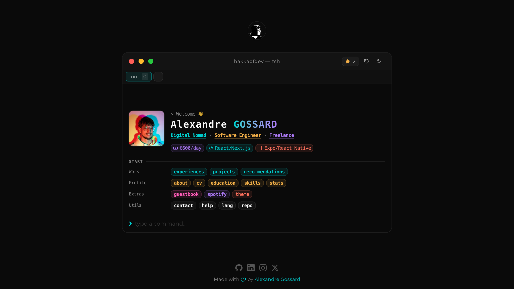

<div align="center">

# `> hakkaofdev.fr_`

### Interactive terminal-style portfolio

[](https://hakkaofdev.fr)
[](https://github.com/hakkaofdev/hakkaofdev.fr/releases) <!-- x-release-please-version -->
[](https://github.com/hakkaofdev/hakkaofdev.fr/actions)
[](LICENSE)

<br />



<br />
<br />

[](https://nextjs.org)
[](https://react.dev)
[](https://typescriptlang.org)
[](https://tailwindcss.com)
[](https://next-intl.dev)
[](https://supabase.com)
[](https://vercel.com)
[](https://biomejs.dev)
[](https://developer.spotify.com)
[](https://vitest.dev)
[](https://playwright.dev)

</div>

<br />

## Overview

A terminal-inspired portfolio for **Alexandre Gossard** ([@hakkaofdev](https://github.com/hakkaofdev)) — Software Engineer & Digital Nomad.  
Type commands, explore projects, browse skills, sign the guestbook, and even check what's playing on Spotify.

<br />

## Highlights

| | Feature | Details |
|---|---|---|
| **`>`** | Terminal UI | Command input, history navigation, autocomplete, fuzzy did-you-mean, pipe-style filters (`help \| grep spotify`) |
| **`>`** | 20 base commands | `help` `projects` `skills` `experiences` `education` `about` `contact` `guestbook` `cv` `repo` `theme` `stats` `echo` `clear` `reset` `spotify` `lang` `alias` `history` `man` |
| **`>`** | i18n (22 locales) | `next-intl` with locale-aware routing, RTL support (Arabic, Hebrew), browser detection, `lang` command |
| **`>`** | Spotify integration | "Now Playing" header widget + `spotify now` / `spotify top` / `spotify history` |
| **`>`** | Guestbook | Public sign & read, honeypot + per-IP rate-limiting, moderation-ready |
| **`>`** | Dynamic CV | Server-rendered PDF via `@react-pdf/renderer` — locale-subsetted Noto fonts, preview or download |
| **`>`** | Advanced Theming | 11 built-in terminal themes (Dracula, Nord, Solarized, Tokyo Night, Catppuccin Latte, …) + custom theme support with preview & WCAG validation |
| **`>`** | Hardened security | Strict CSP, HSTS, `X-Frame-Options: DENY`, `Permissions-Policy`, `frame-ancestors 'none'` |
| **`>`** | SEO | Sitemap, robots.txt, JSON-LD, build-time OG image, hreflang `alternate` links |
| **`>`** | Analytics | Vercel Speed Insights + Supabase page-view tracking with bot-UA filter |
| **`>`** | Tested | 240+ unit / integration tests (Vitest + RTL) + E2E suite (Playwright, Chromium + Firefox), coverage gating in CI |

<br />

## Quick Start

> **Prerequisites** — Node.js 22+ &nbsp;·&nbsp; pnpm 9+

```bash
# clone & install
git clone https://github.com/hakkaofdev/hakkaofdev.fr.git
cd hakkaofdev.fr
pnpm install

# develop
pnpm dev          # → http://localhost:3000

# production
pnpm build && pnpm start
```

Copy `.env.example` to `.env.local` and fill in the values you need:

```bash
# Required
NEXT_PUBLIC_SITE_URL=http://localhost:3000

# Spotify (optional — enables widget + commands)
SPOTIFY_CLIENT_ID=
SPOTIFY_CLIENT_SECRET=
SPOTIFY_REFRESH_TOKEN=

# Supabase (optional — enables analytics + guestbook)
NEXT_PUBLIC_SUPABASE_URL=
SUPABASE_SERVICE_ROLE_KEY=
APP_IP_SALT=
GUESTBOOK_AUTO_APPROVE=true
GUESTBOOK_RATE_LIMIT_MAX_PER_HOUR=3
```

<br />

## Commands Reference

| Command | Description |
|---|---|
| `help` | List all available commands |
| `projects` | Show projects grid |
| `skills` | Show categorized skills |
| `about` | Personal details, languages, hobbies |
| `education` | Education timeline |
| `experiences` | Experience timeline |
| `guestbook` | List & sign guestbook entries |
| `contact` | Contact methods & social profiles |
| `cv` | Open CV preview / download |
| `repo` | Repository details & clone command |
| `theme` | Manage themes: `theme list`, `theme set <name>`, `theme preview <name>`, `theme create`, `theme validate` |
| `stats` | Coding, GitHub & visitor analytics — sub-commands: `stats countries`, `stats browsers`, `stats referrers`, `stats trend` |
| `stats --last <range>` | Filter any `stats` view by time range — `24h`, `7d`, `30d`, `90d`, `all` (also accepts `--7d`, `--month`, etc.) |
| `echo <msg>` | Print custom text |
| `clear` | Clear terminal output |
| `reset` | Reset to the welcome screen |
| `spotify` | Spotify sub-command help |
| `spotify now` | Currently playing track |
| `spotify top` | Top tracks |
| `spotify history` | Recently played tracks |
| `lang` | Show current locale and list supported locales |
| `lang set <locale>` | Switch UI language (e.g. `lang set fr`) |
| `lang auto` | Restore browser-locale auto-detection |
| `alias` | List defined aliases |
| `alias <name>=<command>` | Define a shortcut (e.g. `alias hi=about`) |
| `alias remove <name>` | Remove a single alias |
| `alias clear` | Remove all aliases |
| `history` | Show this session's command history with timestamps |
| `man <command>` | Show the manual page (synopsis, description, examples) |
| `<cmd> \| grep <pat>` | Filter the output of `help`, `history`, `man`, `alias` |

<br />

## Project Structure

```
app/
├── api/            # Route handlers (cv, guestbook, spotify, views)
├── layout.tsx      # Root layout, providers, fonts
├── page.tsx        # Home (terminal shell)
├── sitemap.ts      # Dynamic sitemap
└── robots.ts       # Robots config

components/
├── commands/       # Command descriptors, registries, renderers
├── cv-pdf/         # React-PDF sections for CV generation
├── ui/             # Reusable UI primitives
├── Terminal.tsx     # Main terminal component
└── WelcomeHero.tsx # Initial greeting block

lib/
├── constants/      # Site, resume, skills, terminal, guestbook config
├── cv/             # CV data mapping & PDF styles
├── schemas/        # Zod validation schemas
├── services/       # Analytics, guestbook, Supabase clients
├── themes/         # Theme engine: palettes, provider, storage, contrast validation
└── utils.ts        # Shared helpers

supabase/
└── schema/         # SQL migrations (guestbook table, RLS policies)

tests/
├── e2e/            # Playwright end-to-end specs
├── unit/           # Vitest unit & integration tests (lib, hooks, components, api)
├── setup.ts        # jest-dom + RTL cleanup + jsdom polyfills
└── test-utils.tsx  # `withIntl()` provider for component tests
```

<br />

## Internationalization

Powered by [`next-intl`](https://next-intl.dev) with locale-aware routing (`localePrefix: as-needed`) and 22 supported locales:

| Region | Locales |
|---|---|
| Western European | `en` `fr` `es` `de` `pt` `it` `nl` `ro` |
| Slavic | `ru` `uk` `pl` `cs` |
| Other European | `el` `tr` |
| Asian / Indic | `zh` `ja` `ko` `hi` `vi` `id` |
| Right-to-left | `ar` `he` |

The default locale is detected from the browser; visitors can override it with the `lang` command or the language picker in the terminal header. The choice persists in a cookie. Translations live in `messages/<locale>.json`; routing & RTL helpers in `i18n/routing.ts`.

<br />

## Theme System

The portfolio features a fully customizable theme engine with 11 built-in terminal-inspired themes and support for custom palettes.

**Built-in Themes:**
- `default` — Clean dark theme with cyan accents
- `daylight` — Light theme with warm tones
- `dracula` — Purple & pink dark theme
- `nord` — Arctic-inspired cool palette
- `solarized` — Precision colors for readability
- `monokai` — Vibrant syntax highlighting colors
- `gruvbox` — Retro groove with warm earth tones
- `tokyo-night` — Deep blue night theme
- `github-light` — GitHub's clean light palette
- `catppuccin-latte` — Soothing pastel light theme
- `rose-pine-dawn` — Soft, warm light palette

**Theme Commands:**
```bash
theme list              # Show all available themes with color swatches
theme set dracula       # Apply a theme instantly
theme preview nord      # Preview for 10s, then revert
theme create            # Interactive custom theme builder
theme validate          # WCAG AA contrast audit for the active theme
```

**Custom Themes:**
- Create custom color palettes via the `theme create` command
- Automatic WCAG AA contrast validation ensures readability
- Themes persist in `localStorage` across sessions
- Delete custom themes anytime (built-in themes are protected)

All theme changes apply instantly with smooth color transitions.

<br />

## Customization

**Content** lives in `lib/constants/` — edit the files there to change projects, skills, education, experiences, and social links.

**Themes** are in `lib/themes/palettes/` — each theme exports a `ThemePalette` object with color definitions and metadata. See existing themes as templates.

**Adding a command:**

1. Add it to `COMMANDS` in `components/commands/command-descriptors.ts`
2. Create a renderer in `components/commands/renders/`
3. Wire it in the registry under `components/commands/registries/`

**Adding dynamic autocomplete parameters:**

Commands can have smart autocomplete for their parameters (like `theme set <themeName>`). To add your own:

```typescript
// 1. Create a parameter provider function
function getOptions(): string[] {
  return ["option1", "option2", "option3"];
}

// 2. Register the command pattern
import { registerDynamicParamCommand } from "@/components/commands/registries/dynamic-param-registry";

registerDynamicParamCommand({
  pattern: "mycommand action",
  paramProvider: getOptions,
  group: "Terminal",
});

// 3. Import your registry in components/providers/Providers.tsx
```

See `components/commands/registries/EXAMPLES.ts` for more patterns (localStorage, async data, context-aware, etc.)

**State persistence (Lighthouse-friendly default):**

- Session/tab history is intentionally **not** persisted (`stores/terminal-sessions.store.ts`) to avoid hydration/boot overhead.
- UI preferences still persist in `localStorage` (see `stores/terminal-preferences.store.ts` for font + scrollback and `stores/theme.store.ts` for theme settings).
- If you want session/tab persistence for an educational/demo build, you can toggle it back in the store by replacing the plain Zustand store with a `persist(...)` wrapper.

```ts
// Example (educational/demo only): persist session tabs/history
import { create } from "zustand";
import { createJSONStorage, persist } from "zustand/middleware";

const createSessionStore = (set) => ({
  /* same session/tab logic as your current store initializer */
});

export const useTerminalSessionsStore = create<TerminalSessionsStore>()(
  persist(createSessionStore, {
    name: "terminal-sessions-store",
    storage: createJSONStorage(() => localStorage),
  }),
);
```

**Customizing the CV:** update data in `lib/cv/cv-pdf.data.ts`, styles in `lib/cv/cv-pdf.styles.ts`, and sections in `components/cv-pdf/CVSections.tsx`.

**Guestbook backend:** SQL schema in `supabase/schema/guestbook.sql`, API in `app/api/guestbook/route.ts`, tune with `GUESTBOOK_*` env vars.

<br />

## Testing

The codebase ships with a full test suite covering pure logic, hooks, components, API routes, and end-to-end flows.

**Stack** — [Vitest](https://vitest.dev) (jsdom) · [@testing-library/react](https://testing-library.com/react) · [@testing-library/user-event](https://testing-library.com/user-event) · [Playwright](https://playwright.dev) · [`@vitest/coverage-v8`](https://vitest.dev/guide/coverage.html)

**Layout**

| Layer | Where | What's covered |
|---|---|---|
| Pure logic | `tests/unit/lib/**` | Utils (string / number / url / grep / request / terminal), command descriptors + registry, theme contrast & WCAG validation, zod schemas, guestbook service |
| Stores | `tests/unit/stores/**` | `aliases.store` CRUD + `expandAlias` cycle protection |
| Hooks | `tests/unit/hooks/**` | `useSuggestions`, `useCommandHistory`, `useInputHandlers` (full key matrix), `useGlobalShortcuts` |
| Components | `tests/unit/components/**` | `Terminal`, `TerminalInput`, `SuggestionList`, `CommandItem` |
| API routes | `tests/unit/api/**` | `/api/views`, `/api/guestbook`, `/api/guestbook/countries`, `/api/cv` |
| E2E | `tests/e2e/**` | Typing flows, autocomplete, theme switching, Ctrl+L, guestbook navigation — Chromium + Firefox |

**Running tests**

```bash
pnpm test             # Run unit & integration tests (CI mode)
pnpm test:watch       # Watch mode for development
pnpm test:ui          # Vitest UI dashboard
pnpm test:coverage    # Generate coverage report (text + HTML + lcov)

pnpm test:e2e         # Run Playwright E2E across all browsers
pnpm test:e2e:ui      # Playwright UI mode
```

Coverage is gated in CI by baseline thresholds (`vitest.config.ts`) — meant as a regression floor that ratchets up over time, not a target percentage.

<br />

## CI / CD

| Workflow | Trigger | What it does |
|---|---|---|
| `ci.yml` → `quality` | PR / push to `main` | Lint, typecheck, build |
| `ci.yml` → `test` | PR / push to `main` | `pnpm test:coverage` + uploads coverage report artifact |
| `ci.yml` → `e2e` | PR / push to `main` | Installs Playwright browsers, runs `pnpm test:e2e`, uploads HTML report on failure |
| `dependency-audit.yml` | PR / weekly | `pnpm audit --prod --audit-level=high` |
| `release.yml` | Push to `main` | Release-please automated versioning |

Deployed on **Vercel** — push to `main` and it ships.

<br />

## Quality Scripts

```bash
pnpm lint              # Biome lint
pnpm format            # Biome format
pnpm typecheck         # tsc --noEmit
pnpm audit             # Dependency audit
pnpm test              # Vitest unit & integration suite
pnpm test:coverage     # Vitest with v8 coverage
pnpm test:e2e          # Playwright end-to-end suite
```

<br />

## License

MIT — see [LICENSE](LICENSE) for details.

<br />

<div align="center">

Made by [Alexandre Gossard](https://hakkaofdev.fr)

[](https://github.com/hakkaofdev)
[](https://linkedin.com/in/hakkaofdev)
[](https://x.com/hakkaofdev)

</div>
